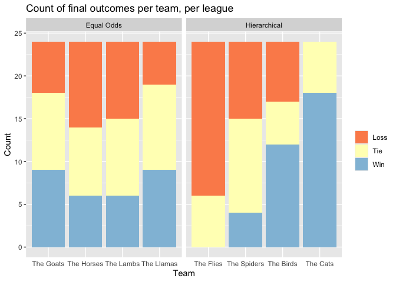

Cricket Competitiveness
================
Andrew Bartnof
2025

I prefer sports when the teams are evenly-matched, and I like cricket,
so I made this quick analysis to answer the question: which kinds of
domestic cricket competitions are the most evenly-matched?

``` r
library(tidyverse)
library(lme4)
library(psych)
library(sjstats)
```

``` r
fn_counterfactuals <- '/Volumes/Extreme SSD/cricket/clean_data/counterfactuals.csv'
fn_results <- '/Volumes/Extreme SSD/cricket/clean_data/results_munged.csv'

Results <- read_csv(fn_results, col_types = cols(.default = 'c', year = 'i', team_score = 'i'))

counterfactual_teams <- c(
    'The Flies', 'The Spiders', 'The Birds', 'The Cats', 
    'The Goats', 'The Horses', 'The Lambs', 'The Llamas'
)
Counterfactuals <- read_csv(fn_counterfactuals, col_types = cols(.default = 'c', team_score = 'i'))
Counterfactuals$team <- ordered(Counterfactuals$team, levels = counterfactual_teams)
```

## Introduction

This section is for people who don’t recall what a standard deviation
is, and want to know why I’d turn to standard deviations as a good
metric for a league’s competitiveness.

Imagine two sports leagues.

**Hierarchical League**

This league has four teams (Wikipedia contributors 2025b):

- The Flies

- The Spiders

- The Birds

- The Cats

Each team will play each other team four times. Let’s say that for
whatever reason, 1 in 3 of these games will be a tie. For the other 2/3
of the games, we already know who’s going to win.

- The Flies can’t beat anybody

- The Spiders beat the Flies

- The Birds beat The Spiders and The Flies

- The Cats beat everyone

**Equal Odds League**

This league also has four teams:

- The Goats

- The Horses

- The Lambs

- The Llamas

Unlike the Hierarchical League, this league is just a bunch of mostly
peaceful pastoral animals. Once again, each team will play each other
team four times. Once again, let’s say that for whatever reason, 1 in 3
of these games will also be a tie; however, in this league, each team is
equally likely to win.

In the Equal Odds League, any team is equally like to get a tie (1/3 of
the games), to win (1/3 of the games), or to lose (1/3 of the games).

I’ve run a quick simulation of these two leagues. Here’s each team’s
outcome:

``` r
Counterfactuals %>%
count(name_of_scenario, team, team_outcome) %>%
ggplot(aes(x = team, y = n, fill = team_outcome)) +
geom_col(position = 'stack') +
facet_wrap(~name_of_scenario, scales = 'free_x') +
scale_fill_brewer(palette = 'RdYlBu') +
labs(x = 'Team', y = 'Count', title = 'Count of final outcomes per team, per league', fill = '') +
theme(axis.ticks.x = element_blank())
```

<!-- -->

Each team in the Equal Odds League could win any game, and their
outcomes look the same, albeit with a bit of random variance. In
contrast, you can see the hierarchy that’s baked into the Hierarchical
League; The Flies have never won a game, and The Cats have never lost
one.

Next, I’d like to calculate the leagues’ standings. Let’s give a team 3
points for a win, 1 for a tie, and 0 for a loss.  Now, our standings
look like this:

``` r
CteCounterfactualCount <-
    Counterfactuals %>%
    count(name_of_scenario, team, team_outcome) %>%
    spread(team_outcome, n) %>%
    mutate_if(is.numeric, replace_na, 0L) %>%
    rowwise %>%
    mutate(
        `Games Played` = sum(c(Loss, Tie, Win), na.rm = TRUE)
    ) %>%
    ungroup %>%
    relocate(name_of_scenario, team, `Games Played`, Loss, Tie, Win)

CteCounterfactualPoints <-
    Counterfactuals %>%
    group_by(name_of_scenario, team) %>%
    summarize(Points = sum(team_score)) %>%
    ungroup

CteCounterfactualCount %>%
    left_join(CteCounterfactualPoints) %>%
    relocate(name_of_scenario, team, `Games Played`, Win, Tie, Loss, Points) %>%
    rename(
        League = name_of_scenario,
        Team = team, 
        Wins = Win,
        Ties = Tie,
        Losses = Loss,
    ) %>%
    arrange(desc(League), Team)
```

    ## # A tibble: 8 × 7
    ##   League       Team        `Games Played`  Wins  Ties Losses Points
    ##   <chr>        <ord>                <int> <int> <int>  <int>  <int>
    ## 1 Hierarchical The Flies               24     0     6     18      6
    ## 2 Hierarchical The Spiders             24     4    11      9     23
    ## 3 Hierarchical The Birds               24    12     5      7     41
    ## 4 Hierarchical The Cats                24    18     6      0     60
    ## 5 Equal Odds   The Goats               24     9     9      6     36
    ## 6 Equal Odds   The Horses              24     6     8     10     26
    ## 7 Equal Odds   The Lambs               24     6     9      9     27
    ## 8 Equal Odds   The Llamas              24     9    10      5     37

In the following figure, you can see the final points per team.  The
dotted line in the middle of the diagram shows the mean number of points
per team, per league.

``` r
CteScenarioMeans <-
    CteCounterfactualPoints %>%
    group_by(name_of_scenario) %>%
    summarize(mean = mean(Points)) %>%
    ungroup

CteCounterfactualPoints %>%
    left_join(CteScenarioMeans, by = 'name_of_scenario') %>%
    mutate(is_greater_than_mean = Points > mean) %>%
    ggplot(aes(x = team, y = Points)) +
    geom_hline(aes(yintercept = mean), linetype = 'dashed') +
    geom_point(aes(color = is_greater_than_mean), size = 3) +
    facet_wrap(~name_of_scenario, scales='free_x') +
    labs(x = 'Team', y = 'Team final score', title = 'Comparison of each team\'s score', subtitle = 'League mean scores are indicated with the horizontal dashed lines') +
    theme(
        legend.position = 'none',
        axis.ticks.x = element_blank()  
    )
```

<!-- -->

Notice how most of the teams in the Equal Odds team hover somewhere near
the league’s mean? In contrast, in the Hierarchical League, The Flies
and The Cats are really far from the mean. The distance between an
individual team’s score and the league’s mean score is what we’re
looking at here.

- **Deviance:** For any team, figure out the difference between the
  team’s final score, and the league mean score. Square it. (We don’t
  really care if something is way below the mean or way above. All we
  care about is whether it’s far from the mean in any direction. So for
  example, squaring -10 and 10 gives us 100 in both cases— problem
  solved.)

- **Variance:** Take all four teams in either league. If you calculate
  each team’s deviance, and then find the mean deviance, congratulations
  because you’ve just discovered the league’s variance.

- **Standard Deviation:** Variance is a great measure of dispersal, but
  remember that we had to square the values a few steps up, so our
  variance is distractingly high. Take the square-root of the variance,
  and now you have the standard deviation!

Remember how far The Cats and The Flies team scores were from the
Hierarchical League’s mean score?  This means the Hierarchical League is
dealing with some pretty large deviations from the mean. This means the
variance will be kind of high, which means the standard deviation will
be kind of high.

On the other hand, in the Equal Odds League, each team’s final score was
pretty close to the league mean score. This means that the variance, and
the standard deviation, should be much lower.

We can see this in the following diagram:

``` r
CteCounterfactualPoints %>%
    group_by(name_of_scenario) %>%
    summarize(sd = sd(Points)) %>%
    ungroup %>%
    ggplot(aes(x = name_of_scenario, y = sd)) +
    geom_col() +
    theme(axis.ticks.x = element_blank()) +
    labs(x = 'League', y = 'Standard deviation of scores', title = str_wrap('Standard deviation of scores in each league'))
```

<!-- -->

And there you have it— in this made-up example, based on a pretty simple
set of rules, the Hierarchical League had a standard deviation of scores
about five times as large as the Equal Odds League.

Standard deviation is a really good measure, then, to see just how
different the skill levels are for each team in a league.  In a league
with some strong teams and some weak teams, we’ll see a pretty high
standard deviation of scores. In a league where everyone is more-or-less
evenly-matched, we’ll see a lower standard deviation of scores. I like
exciting games where nobody knows who’s going to win— that’s why, all
else being equal, I want to find leagues with a relatively small
standard deviation of scores.

## Cricket

Cricsheet.org (Rushe 2009) provides a wonderful dataset of cricket
records, which we’ll use here. For this analysis, I’ll subset to games
in domestic leagues, excluding international tours and trophies.

Cricsheet does have missing data. This is understandable, since cricket
is the second-most popular sport in the world (Douglas and Church 2024),
and it has been around since the 16th century (Wikipedia contributors
2025a)– there’s a lot of data to collect. If we can assume that the data
is missing uniformly, and not in a way that biases our findings, then we
can proceed!

I’m interested in three variables. I want to see which of these seems to
impact the competitiveness of a league

- Gender

- Match type: Cricket has 3 formats, which are represented here as MDM
  (multi-day match); ODM (one-day match); and T20 (Twenty20).

- Country

``` r
# Calculate the total score per team, per year

TeamTotalScores <-
    Results %>%
    group_by(country, match_type, event_name, year, gender, team) %>%
    summarize(team_total_score = sum(team_score)) %>%
    ungroup
head(TeamTotalScores)
```

    ## # A tibble: 6 × 7
    ##   country   match_type event_name             year gender team  team_total_score
    ##   <chr>     <chr>      <chr>                 <int> <chr>  <chr>            <int>
    ## 1 Australia MDM        Marsh Sheffield Shie…  2019 Male   New …                9
    ## 2 Australia MDM        Marsh Sheffield Shie…  2019 Male   Quee…                6
    ## 3 Australia MDM        Marsh Sheffield Shie…  2019 Male   Sout…                3
    ## 4 Australia MDM        Marsh Sheffield Shie…  2019 Male   Tasm…                0
    ## 5 Australia MDM        Marsh Sheffield Shie…  2019 Male   Vict…                0
    ## 6 Australia MDM        Marsh Sheffield Shie…  2019 Male   West…                3

``` r
# Calculate the standard deviation of team scores per event

EventSD <-
    TeamTotalScores %>%
    group_by(country, match_type, event_name, year, gender) %>%
    summarize(event_sd = sd(team_total_score)) %>%
    ungroup
head(EventSD)
```

    ## # A tibble: 6 × 6
    ##   country   match_type event_name              year gender event_sd
    ##   <chr>     <chr>      <chr>                  <int> <chr>     <dbl>
    ## 1 Australia MDM        Marsh Sheffield Shield  2019 Male       3.51
    ## 2 Australia MDM        Marsh Sheffield Shield  2020 Male       3.10
    ## 3 Australia MDM        Sheffield Shield        2017 Male       3.46
    ## 4 Australia MDM        Sheffield Shield        2018 Male       4.14
    ## 5 Australia MDM        Sheffield Shield        2019 Male       3.63
    ## 6 Australia MDM        Sheffield Shield        2020 Male       3

### Gender

First off, is women’s cricket more competitive than men’s? There are no
women’s multi-day domestic leagues in the dataset, so let’s filter men’s
multi-day matches out.

``` r
ModelSubset <-
    EventSD %>%
    filter(match_type %in% c('T20', 'ODM'))

ggplot(data = ModelSubset, aes(x = gender, y = event_sd, group = gender)) +
    geom_boxplot(varwidth = TRUE) +
    stat_summary(fun=median, geom='label', 
                             aes( label=round(after_stat(y), digits=2))) +
    labs(x = '', y = 'Standard Deviation of Scores', title = 'Impact of gender on standard deviation of scores') +
    theme(axis.ticks.x = element_blank())
```

<!-- -->

These two distributions look pretty similar. The Cohen’s D effect size
is very small.

``` r
with(ModelSubset, cohen.d(x = event_sd, group = factor(gender)))
```

    ## Call: cohen.d(x = event_sd, group = factor(gender))
    ## Cohen d statistic of difference between two means
    ##      lower effect upper
    ## [1,] -0.18   0.16   0.5
    ## 
    ## Multivariate (Mahalanobis) distance between groups
    ## [1] 0.16
    ## r equivalent of difference between two means
    ## data 
    ## 0.07

Let’s compare two multi-level models. In the first, the fixed effects
are year, match type, country, and gender; the random effects are the
events themselves. The second model omits gender.

The answer is– no, the model with gender is not significantly better
than our null model.

``` r
mod_gender1 <- lmer(data = ModelSubset, formula = event_sd ~ year + match_type + country + gender + (1|event_name), REML = FALSE)

mod_gender0 <- lmer(data = ModelSubset, formula = event_sd ~ year + match_type + country + (1|event_name), REML = FALSE)

anova(mod_gender1, mod_gender0)
```

    ## Data: ModelSubset
    ## Models:
    ## mod_gender0: event_sd ~ year + match_type + country + (1 | event_name)
    ## mod_gender1: event_sd ~ year + match_type + country + gender + (1 | event_name)
    ##             npar    AIC    BIC  logLik deviance  Chisq Df Pr(>Chisq)  
    ## mod_gender0   14 848.97 894.43 -410.48   820.97                       
    ## mod_gender1   15 847.81 896.52 -408.91   817.81 3.1587  1    0.07552 .
    ## ---
    ## Signif. codes:  0 '***' 0.001 '**' 0.01 '*' 0.05 '.' 0.1 ' ' 1

### Match Type

``` r
ggplot(data = EventSD, aes(x = match_type, y = event_sd, group = match_type)) +
    geom_boxplot(varwidth = TRUE) +
    stat_summary(fun=median, geom='label', 
                             aes( label=round(after_stat(y), digits=2))) +
    labs(x = '', y = 'Standard Deviation of Scores', title = 'Impact of match type on standard deviation of scores') +
    theme(axis.ticks.x = element_blank())
```

<!-- -->

Match type does seem to impact league competitiveness; however, a
chi-squared test indicates that it is not significant.

``` r
chisq.test(EventSD$event_sd, EventSD$match_type, simulate.p.value = TRUE)
```

    ## 
    ##  Pearson's Chi-squared test with simulated p-value (based on 2000
    ##  replicates)
    ## 
    ## data:  EventSD$event_sd and EventSD$match_type
    ## X-squared = 360.75, df = NA, p-value = 0.3098

On the other hand, a comparison of multi-level models which controls for
year, gender, country, and event indicates that match type is highly
significant!

I find the multi-level model’s report more compelling than the
chi-squared test, but it takes all kinds in this world– that’s why I
present both.

``` r
mod_type1 <- lmer(data = EventSD, formula = event_sd ~ year + gender + country + match_type + (1|event_name))
mod_type0 <- lmer(data = EventSD, formula = event_sd ~ year + gender + country + (1|event_name))
anova(mod_type1, mod_type0)
```

    ## refitting model(s) with ML (instead of REML)

    ## Data: EventSD
    ## Models:
    ## mod_type0: event_sd ~ year + gender + country + (1 | event_name)
    ## mod_type1: event_sd ~ year + gender + country + match_type + (1 | event_name)
    ##           npar     AIC    BIC  logLik deviance  Chisq Df Pr(>Chisq)   
    ## mod_type0   14 1004.53 1052.4 -488.26   976.53                        
    ## mod_type1   16  996.08 1050.8 -482.04   964.08 12.449  2    0.00198 **
    ## ---
    ## Signif. codes:  0 '***' 0.001 '**' 0.01 '*' 0.05 '.' 0.1 ' ' 1

### Country

I’ve subsetted to the countries with test status in the ICC. (Note:
Afghanistan has been omitted from Cricsheet (Rushe 2024), and Cricsheet
doesn’t yet seem to have any data on domestic cricket in Zimbabwe.)

``` r
EventSD %>%
    mutate(
        country = str_replace_all(country, '\\s', '\n'),
        country = fct_reorder(country, -event_sd),
        ) %>%
    ggplot(aes(x = country, y = event_sd, group = country)) +
    geom_hline(yintercept = median(EventSD$event_sd), linetype = 'dashed') +
    geom_boxplot(varwidth = TRUE) +
    labs(x = '', y = 'Standard deviation of scores', title = 'Impact of country on standard deviation of scores', subtitle = 'Median scores are indicated with the horizontal dashed lines') +
    theme(axis.ticks.x = element_blank())
```

<!-- -->

Ireland, New Zealand, and Australia are the only countries whose median
standard deviation of scores is under the overall median, which is to
say, they are the ones with the most competitive leagues.

A chi-squared test indicates that country does not have a significant
impact on the standard deviation of scores.

``` r
chisq.test(EventSD$event_sd, factor(EventSD$country), simulate.p.value = TRUE)
```

    ## 
    ##  Pearson's Chi-squared test with simulated p-value (based on 2000
    ##  replicates)
    ## 
    ## data:  EventSD$event_sd and factor(EventSD$country)
    ## X-squared = 1648.5, df = NA, p-value = 0.05297

But once again, when the multi-level model controls for year, gender,
and event, country becomes highly significant!

``` r
mod_country1 <- lmer(data = EventSD, formula = event_sd ~ year + gender + country + match_type + (1|event_name))

mod_country0 <- lmer(data = EventSD, formula = event_sd ~ year + gender + match_type + (1|event_name))

anova(mod_country1, mod_country0)
```

    ## refitting model(s) with ML (instead of REML)

    ## Data: EventSD
    ## Models:
    ## mod_country0: event_sd ~ year + gender + match_type + (1 | event_name)
    ## mod_country1: event_sd ~ year + gender + country + match_type + (1 | event_name)
    ##              npar    AIC    BIC  logLik deviance  Chisq Df Pr(>Chisq)  
    ## mod_country0    7 997.25 1021.2 -491.63   983.25                       
    ## mod_country1   16 996.08 1050.8 -482.04   964.08 19.175  9    0.02374 *
    ## ---
    ## Signif. codes:  0 '***' 0.001 '**' 0.01 '*' 0.05 '.' 0.1 ' ' 1

### Conclusion

If you want to watch a highly-competitive domestic cricket competition,
choose an Irish (or barring that, NZ or Oz) league– the longer the
matches, the better– and don’t worry about gender.

### Appendix: More Multi-Level Model Data

``` r
mod <- lmer(data = EventSD, formula = event_sd ~ year + gender + country + match_type + (1|event_name))

summary(mod)
```

    ## Linear mixed model fit by REML ['lmerMod']
    ## Formula: event_sd ~ year + gender + country + match_type + (1 | event_name)
    ##    Data: EventSD
    ## 
    ## REML criterion at convergence: 953.6
    ## 
    ## Scaled residuals: 
    ##     Min      1Q  Median      3Q     Max 
    ## -2.3885 -0.5864 -0.1113  0.5413  3.8204 
    ## 
    ## Random effects:
    ##  Groups     Name        Variance Std.Dev.
    ##  event_name (Intercept) 1.373    1.172   
    ##  Residual               3.769    1.941   
    ## Number of obs: 226, groups:  event_name, 42
    ## 
    ## Fixed effects:
    ##                            Estimate Std. Error t value
    ## (Intercept)              -129.86636   82.02474  -1.583
    ## year                        0.06622    0.04057   1.632
    ## genderMale                  0.80747    0.64528   1.251
    ## countryBangladesh           0.94801    1.54263   0.615
    ## countryEngland and Wales    0.73757    0.85717   0.860
    ## countryIndia               -1.01012    1.02699  -0.984
    ## countryIreland             -2.41081    1.30038  -1.854
    ## countryNew Zealand         -1.17847    0.96610  -1.220
    ## countryPakistan            -0.48164    1.55599  -0.310
    ## countrySouth Africa         0.32724    1.10670   0.296
    ## countrySri Lanka           -0.94585    1.67694  -0.564
    ## countryWest Indies         -1.01576    1.10951  -0.916
    ## match_typeODM               1.12431    1.02741   1.094
    ## match_typeT20               2.24829    0.77334   2.907

    ## 
    ## Correlation matrix not shown by default, as p = 14 > 12.
    ## Use print(value, correlation=TRUE)  or
    ##     vcov(value)        if you need it

``` r
performance::icc(mod)
```

    ## # Intraclass Correlation Coefficient
    ## 
    ##     Adjusted ICC: 0.267
    ##   Unadjusted ICC: 0.208

<div id="refs" class="references csl-bib-body hanging-indent">

<div id="ref-ap_guide_to_cricket" class="csl-entry">

Douglas, Steve, and Brian Church. 2024. “The World’s Second Most Popular
Sport: An AP Guide to Cricket.”
<https://apnews.com/article/t20-cricket-world-cup-united-states-west-indies-07bc2c9a37e907654c56ca12f27c88cd>.

</div>

<div id="ref-cricsheet" class="csl-entry">

Rushe, Stephen. 2009. “CricSheet.” <https://cricsheet.org>.

</div>

<div id="ref-cricsheet_afghanistan" class="csl-entry">

———. 2024. “<span class="nocase">Explanation for Withholding of
Afghanistani Matches </span>.”
<https://cricsheet.org/article/explanation-for-withholding-of-afghanistani-matches/>.

</div>

<div id="ref-enwiki:1266587500" class="csl-entry">

Wikipedia contributors. 2025a. “History of Cricket to 1725 — Wikipedia,
the Free Encyclopedia.”
<https://en.wikipedia.org/w/index.php?title=History_of_cricket_to_1725&oldid=1266587500>.

</div>

<div id="ref-enwiki:1278062334" class="csl-entry">

———. 2025b. “There Was an Old Lady Who Swallowed a Fly — Wikipedia, the
Free Encyclopedia.”
<https://en.wikipedia.org/w/index.php?title=There_Was_an_Old_Lady_Who_Swallowed_a_Fly&oldid=1278062334>.

</div>

</div>
